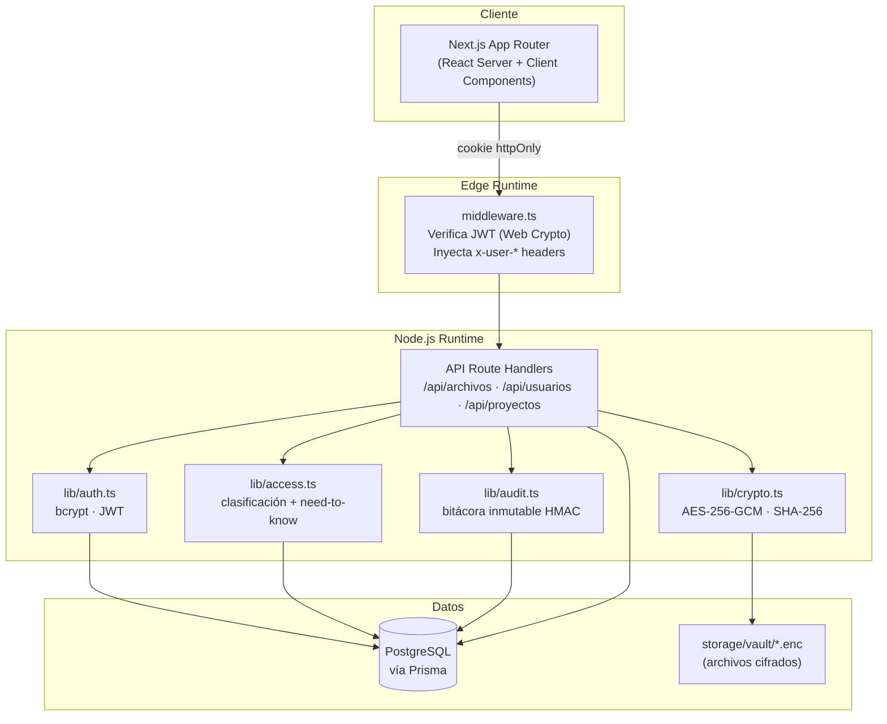
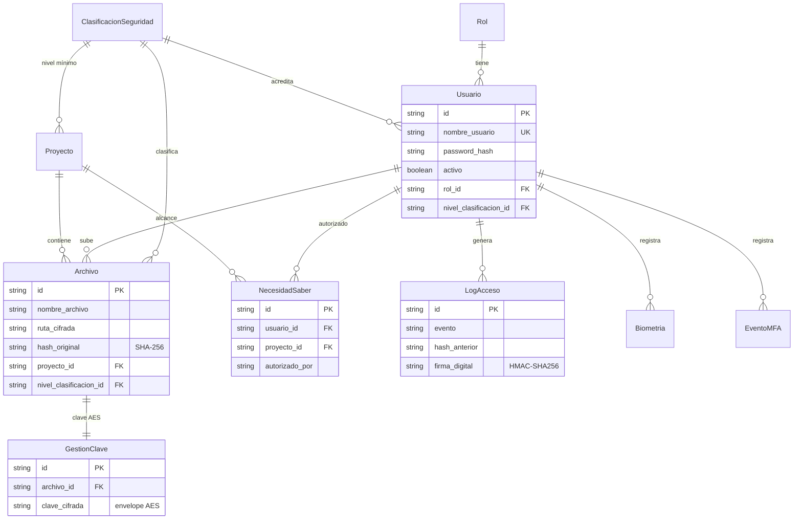
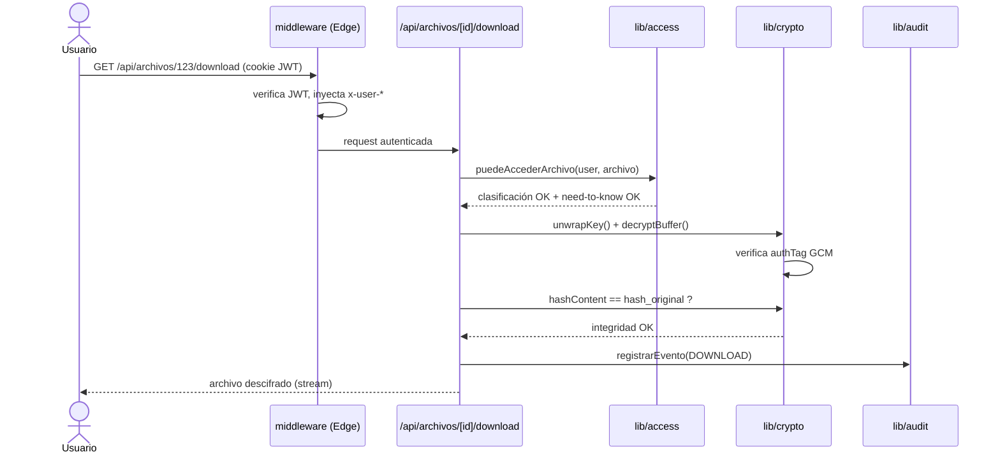

# 🔐 Sistema de Bóveda Segura

Repositorio documental de alta seguridad construido con **Next.js 15** (App Router),
**Prisma** y **PostgreSQL**. Implementa cifrado de archivos en reposo
(AES‑256‑GCM), control de acceso por **rol + clasificación + necesidad de saber**
y una **bitácora de auditoría inmutable** encadenada por firma HMAC.

---

## ✨ Características de seguridad

- **Cifrado en reposo** — cada archivo se cifra con su propia clave AES‑256‑GCM;
  esa clave se guarda *envuelta* (envelope encryption) con la `MASTER_KEY` del
  servidor en la tabla `gestion_claves`.
- **Integridad** — se almacena el SHA‑256 del contenido original y se reverifica
  en cada descarga.
- **Control de acceso multicapa** — clasificación (Bell‑LaPadula "no read up") +
  necesidad de saber por compartimento.
- **Bitácora inmutable** — cadena de firmas HMAC‑SHA256 (estilo libro mayor) y
  reglas SQL que bloquean `UPDATE`/`DELETE`.
- **Separación de runtimes** — verificación JWT en el Edge (Web Crypto API) y
  lógica Node.js en los route handlers.

---

## 🏛️ Arquitectura



---

## 🗃️ Modelo de datos



---

## 🔓 Flujo de acceso a un archivo



> Si cualquier barrera falla, se responde `403/409` y se registra un evento
> `ACCESS_DENIED` en la bitácora inmutable.

---

## 🚀 Puesta en marcha

```bash
npm install
cp .env.example .env.local          # completar credenciales reales
npm run db:setup                    # generate + migrate + harden (reglas inmutables) + seed
npm run dev
```

> `db:setup` encadena todo. Equivale a: `prisma generate` →
> `prisma migrate dev` → `npm run db:harden` (aplica `prisma/immutability.sql`)
> → `npm run db:seed`.

Generar las claves de cifrado y firma:

```bash
node -e "console.log('MASTER_KEY=' + require('crypto').randomBytes(32).toString('hex'))"
node -e "console.log('HMAC_SECRET=' + require('crypto').randomBytes(32).toString('hex'))"
```

### Credenciales tras el seed

| Usuario | Contraseña | Rol | Acreditación |
|---|---|---|---|
| `admin` | `Admin1234!` | Administrador | TOP_SECRET |
| `gestor` | `Gestor1234!` | Gestor | CONFIDENCIAL |
| `analista` | `Analista1234!` | Analista | NORMAL |

---

## 🧪 Comandos

```bash
npm run dev        # servidor de desarrollo (Turbopack)
npm run build      # build de producción
npm run lint       # ESLint
npm test           # pruebas unitarias (Vitest)
npm run test:watch # pruebas en modo watch

npx prisma studio  # explorador visual de la BD
npx prisma migrate dev --name <nombre>   # nueva migración
```

> ⚠️ Tras cada `prisma migrate`, ejecutar `npm run db:harden` para reaplicar las
> reglas de inmutabilidad de la bitácora (`prisma/immutability.sql`, idempotente),
> ya que Prisma no genera reglas `RULE` automáticamente.

---

## 📦 Stack

- **Next.js 15** · App Router · React 19
- **Prisma 5** + **PostgreSQL**
- **bcryptjs** (hash de contraseñas) · **jsonwebtoken** (sesión)
- **Node.js crypto** (AES‑256‑GCM, SHA‑256, HMAC)
- **Tailwind CSS** · **Vitest**

Detalles de arquitectura interna y convenciones en
[`CLAUDE.md`](CLAUDE.md) y [`CONTRIBUTING.md`](CONTRIBUTING.md).
